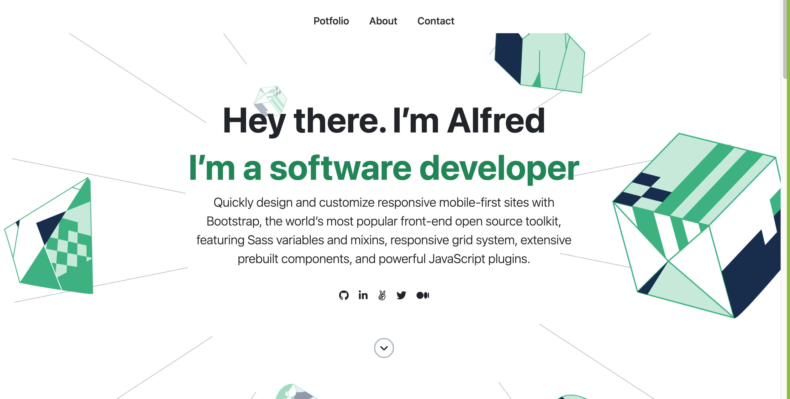

# Portfolio Bootstrap

> In this project we build a portfolio website with bootstrap

## Built With

- HTML
- CSS
- Bootstrap

## Live Demo (if available)

[Live Demo Link](https://livedemo.com)

## Getting Started

To get a local copy up and running follow these simple steps.

### Prerequisites

- Code Editor (e.g. VS Code, Atom)
- Web browser 

### Setup

- Create a folder in your local machine
- Open your console in your folder and run this command: `git clone https://github.com/learnwithalfred/portfolio-bootstrap.git`

### Install

### Usage

### Run tests

### Deployment

## Authors

👤 **Alfred Boateng**

- GitHub: [@learnwithalfred](https://github.com/learnwithalfred)
- Twitter: [@kb_alfred](https://twitter.com/kb_alfred)
- LinkedIn: [LinkedIn](https://linkedin.com/in/linkedinhandle)

👤 **Dino Quispe**

- GitHub: [@dqarias](https://github.com/dqarias)
- Twitter: [@DinoRonald7](https://twitter.com/DinoRonald7?t=Zanx9DXMEG9C_PNF3woZFg&s=08)
- LinkedIn: [Dino Quispe](https://www.linkedin.com/in/dino-ronald-quispe-arias-8ba72174/)

## 🤝 Contributing

Contributions, issues, and feature requests are welcome!

Feel free to check the [issues page](../../issues/).

## Show your support

Give a ⭐️ if you like this project!

## Acknowledgments

- Hat tip to anyone whose code was used
- Inspiration
- etc

## 📝 License

This project is [MIT](./MIT.md) licensed.
